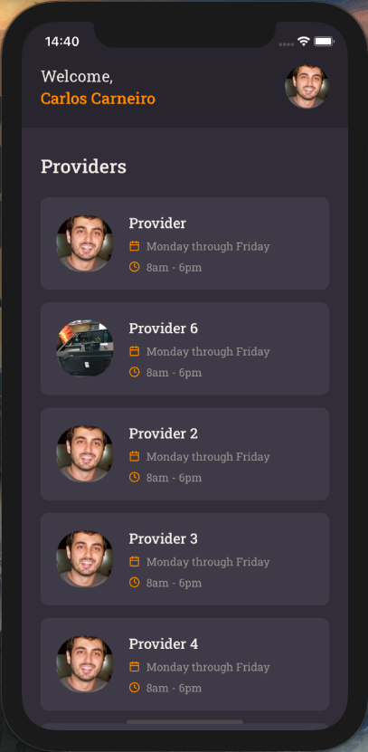

# GoBarber Mobile App

# Starting

Make sure you've downloaded the [api-go-barber](https://www.github.com/cacpmw/api-go-barber) project and it is running.

## iOS

1. Run `cd ios && pod install`
1. Run `cd .. && yarn ios`
